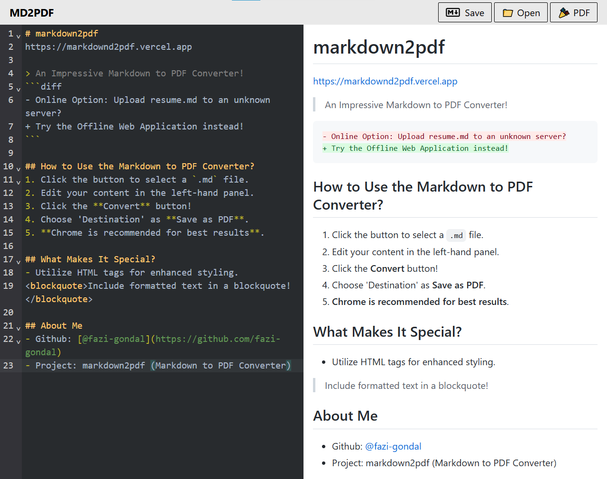

<h1 align="center"><a href="https://markdownd2pdf.vercel.app/">Markdown2pdf</a></h1>

> An Impressive Markdown to PDF Converter!
```diff
- Online Option: Upload resume.md to an unknown server?
+ Try the Offline Web Application instead!
```



### Try out the website : [markdown2pdf](https://markdownd2pdf.vercel.app/)

### Key Features (Use as Highlights)
✨ **Instant Conversion** - Real-time preview as you type
🎨 **GitHub Flavored Markdown** - Full GFM support with tables, code blocks, and syntax highlighting
📊 **Rich Content Support** - LaTeX math formulas & Mermaid diagrams
🔒 **Privacy-First** - All processing happens locally in your browser
💻 **Developer-Friendly** - Code syntax highlighting for 100+ languages
📱 **Responsive Design** - Works perfectly on desktop and mobile
⚡ **No Installation** - Pure web app, zero setup required

## 👉 How to Use
1. Click the button to select a `.md` file.
2. Edit your content in the left-hand panel.
3. Click the **Convert** button!
4. Choose 'Destination' as **Save as PDF**.
5. **Chrome is recommended for best results**.

## 👨‍🔧 Tech Stack

This project is built with the following technologies:

- [React](https://react.dev/)
- [Vite](https://vitejs.dev/)
- [Tailwind CSS](https://tailwindcss.com/)
- [UIW React CodeMirror](https://uiwjs.github.io/react-codemirror/)
- [UIW React Markdown Preview](https://github.com/uiwjs/react-markdown-preview)

## 🛠️ Installation Steps

1. Fork the repository on GitHub.
2. Clone your forked copy of the project
   ```bash
   git clone https://github.com/<your-github-username>/md2pdf.git
   ```
3. Change the working directory
   ```bash
   cd md2pdf
   ```
4. Install dependencies
   ```bash
   npm install
   ```
5. Run the app
   ```bash
   npm run dev
   ```
      
## About Me
- Github: [@fazi-gondal](https://github.com/fazi-gondal)
- Project: markdown2pdf (Markdown to PDF Converter)

## LICENSE  
This project is licensed under the [MIT License](LICENSE).
